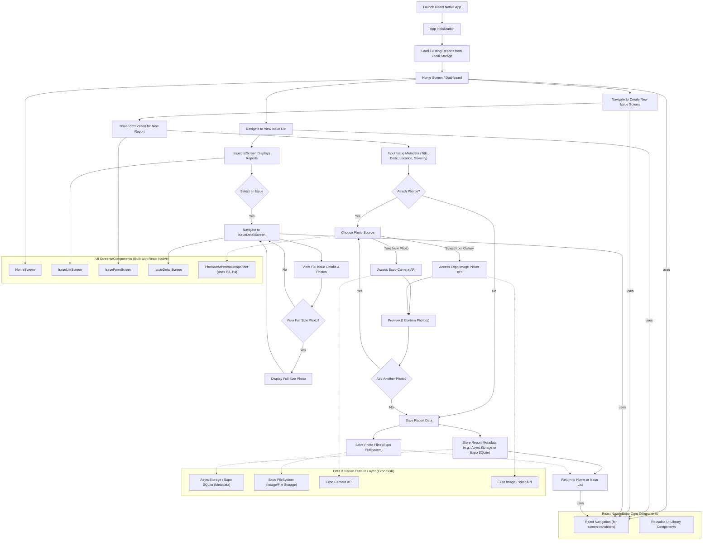

## Product Requirements Document: Onsite Reporting App Prototype (React Native/Expo + NativeWind UI)

**1. Introduction**

This document outlines the requirements for a prototype of an Onsite Reporting App. The app aims to provide onsite technicians with a simple and efficient tool to report issues, capture photographic evidence, and document site conditions directly from their mobile devices. This prototype will be developed using **React Native with the Expo framework**, targeting **Android-platform compatibility**. A **NativeWind UI library** will be utilized to accelerate development and ensure a consistent user interface. The primary goal of this prototype is to validate core functionality and gather user feedback for future development.

# Project Structure

## App (Routing)
- app/
  - _layout.tsx (Navigation container with tabs)
  - index.tsx (Home screen/Dashboard)
  - issues/
    - index.tsx (Issue list screen)
    - [id].tsx (Issue detail screen) 
    - new.tsx (New issue form screen)

## Components
- components/
  - ui/ (Reusable UI components with NativeWind)
    - Button.tsx
    - Card.tsx
    - Input.tsx
    - Select.tsx
    - Badge.tsx (for severity indicators)
  - issues/
    - IssueCard.tsx (List item component)
    - IssueForm.tsx (Form for creating issues)
    - PhotoAttachment.tsx (Photo handling component)
    - PhotoGallery.tsx (Grid view of thumbnails)
    - PhotoViewer.tsx (Full-screen photo view)

## Types
- types/
  - issue.ts (Issue and related interfaces)
  - photo.ts (Photo type definitions)

## Services
- services/
  - storage/
    - issueStorage.ts (AsyncStorage for issue data)
    - photoStorage.ts (Expo FileSystem for photos)
  - camera/
    - cameraService.ts (Expo Camera integration)
  - imagePicker/
    - imagePickerService.ts (Gallery integration)

## Hooks
- hooks/
  - useIssues.ts (CRUD operations for issues)
  - usePhotos.ts (Photo management)
  - useCamera.ts (Camera interactions)

## Utilities
- utils/
  - date.ts (Date formatting)
  - validation.ts (Form validation)
  - fileSystem.ts (File handling)

## Constants
- constants/
  - colors.ts (Theme colors)
  - severity.ts (Severity levels)
  - layout.ts (Screen dimensions and spacing)

## Context
- contexts/
  - IssueContext.tsx (Global state for issues)

**2. Goals/Objectives**

*   **Primary Goal:** Enable technicians to quickly create and submit site issue reports, including attached photos, using a mobile device.
*   Validate the usability and intuitiveness of the core reporting workflow for technicians.
*   Assess the feasibility of using **React Native with Expo** for the required functionalities, specifically camera access and local data handling for the prototype.
*   Gather feedback on essential features for a minimum viable product (MVP).
*   Demonstrate the core concept to stakeholders.

**3. Target Audience**

*   Onsite Technicians: Individuals performing fieldwork who need to report issues, maintenance requirements, or site observations. They require a tool that is easy to use in various field conditions, potentially with intermittent connectivity.

**4. Scope (Prototype)**

This prototype will focus on the core functionality of creating and viewing issue reports with photo attachments within a mobile application.

**In Scope:**

*   **Issue Creation:**
    *   Ability to create a new issue report.
    *   Input fields for:
        *   Issue Title/Name
        *   Description of the issue
        *   Location (manual text input for prototype)
        *   Date & Time (auto-populated, editable)
        *   Severity (e.g., Low, Medium, High - simple dropdown)
*   **Photo Attachment:**
    *   Access device camera through **Expo APIs** to take a new photo.
    *   Option to select photo(s) from the device gallery using **Expo APIs**.
    *   Attach one or more photos to an issue report.
    *   View thumbnails of attached photos within the issue report.
*   **Issue List & Viewing:**
    *   Display a list of locally stored reported issues (e.g., title, date, severity).
    *   Ability to tap on an issue in the list to view its full details, including attached photos.
*   **Native App Features:**
    *   Installable as a native application on iOS and Android devices.
    *   Offline functionality through local data storage on the device.
    *   Local storage for created reports and attached photos.
    *   Responsive design for various mobile screen sizes.

**Out of Scope for Prototype:**

*   User authentication and accounts.
*   Backend synchronization and cloud storage.
*   Advanced reporting features (e.g., PDF generation, custom templates).
*   Offline map integration or GPS-based location tagging (manual input only).
*   Push notifications.
*   Workflow management (e.g., assigning issues, status updates beyond creation).
*   Barcode scanning.
*   Detailed analytics or reporting dashboards.
*   User roles and permissions.

**5. Functional Requirements**

*   **FR1: Create New Issue Report**
    *   **FR1.1:** The user shall be able to initiate the creation of a new issue report.
    *   **FR1.2:** The system shall provide input fields for Issue Title, Description, Location (text), and Severity.
    *   **FR1.3:** The system shall automatically populate the current Date and Time for a new report, allowing the user to modify if necessary.
    *   **FR1.4:** The user shall be able to save the new issue report to **local device storage**.
*   **FR2: Attach Photos to Issue Report**
    *   **FR2.1:** While creating or editing an issue report, the user shall have an option to attach photos.
    *   **FR2.2:** The system shall allow the user to take a new photo using the device's camera via **Expo Camera API**.
    *   **FR2.3:** The system shall allow the user to select one or more existing photos from the device's gallery via **Expo Image Picker API**.
    *   **FR2.4:** Attached photos shall be linked to the respective issue report.
    *   **FR2.5:** The system shall display thumbnails of attached photos within the issue report details.
*   **FR3: View Issue Reports**
    *   **FR3.1:** The user shall be able to view a list of all locally saved issue reports.
    *   **FR3.2:** The list shall display key information for each report (e.g., Title, Date, Severity).
    *   **FR3.3:** The user shall be able to select an issue report from the list to view its full details, including all fields and attached photos.
    *   **FR3.4:** The user shall be able to view full-size versions of attached photos.
*   **FR4: Basic Local Data Persistence and Offline Capability**
    *   **FR4.1:** The application shall be installable as a native app on target iOS and Android devices.
    *   **FR4.2:** The application's core functionalities (creating, viewing reports, attaching photos) shall be usable offline.
    *   **FR4.3:** All created issue reports and their linked photos shall be saved in **local device storage**.
    *   **FR4.4:** Saved reports shall persist even if the application is closed and reopened.

**6. Non-Functional Requirements**

*   **NFR1: Usability**
    *   The app shall have a simple, clean, and intuitive user interface, easy for technicians to learn and use quickly in the field, facilitated by the chosen **React Native Reusable UI library**.
    *   The app shall be responsive and adapt to different mobile screen sizes and orientations.
*   **NFR2: Performance**
    *   The app shall load quickly and feel responsive during user interactions.
    *   Camera access and photo attachment should not cause significant delays.
    *   The app shall remain responsive when handling multiple reports with photos.
*   **NFR3: Compatibility**
    *   The app shall function on target **iOS and Android devices** as supported by the Expo SDK version used.
*   **NFR4: Offline Capability**
    *   Core functions (creating reports, taking/attaching photos, viewing local reports) must work without an active internet connection, relying on **local device storage mechanisms**.

**7. Technical Considerations**

*   **Framework:** **React Native with Expo.**
*   **UI Library:** A designated **React Native Reusable UI library** (e.g., React Native Elements, NativeBase, React Native Paper, or a custom internal library) will be used for standard UI components.
*   **Mobile Functionality / Expo APIs:**
    *   **Camera Access:** Utilize **Expo SDK packages** such as `expo-camera` to access the device camera.
    *   **Photo Gallery Access:** Utilize **Expo SDK packages** like `expo-image-picker` to access the device's photo gallery.
*   **Local Storage:**
    *   Employ local storage mechanisms available in the React Native ecosystem, managed via Expo. Options include:
        *   **AsyncStorage (`@react-native-async-storage/async-storage`):** For simple key-value pair storage of report metadata.
        *   **Expo FileSystem (`expo-file-system`):** For storing photo files locally.
        *   **Expo SQLite (`expo-sqlite`):** For more structured data storage if needed for the prototype.
*   **UI Components:** Leverage components from the chosen **React Native Reusable UI library** and core React Native components for rapid UI development.

**8. Success Metrics (Prototype)**

*   Successful creation and local storage of at least 10 issue reports, each with at least one photo, by a test user without critical errors.
*   Positive feedback from a small group of test technicians (e.g., 3-5) regarding the ease of use for the core reporting task.
*   Ability to view all details and attached photos of locally stored reports.
*   Confirmation that the **React Native app** functions properly offline after initial setup.
*   Task completion time for creating a report with a photo is within an acceptable range (e.g., under 2 minutes for a simple issue).
*   Successfully installable and functional on target **iOS and Android test devices**.

**9. Future Considerations (Out of Scope for Prototype)**

*   User authentication and authorization.
*   Backend integration for centralized data storage and synchronization.
*   Offline data synchronization strategies (when connectivity is restored).
*   Advanced search and filtering of reports.
*   Report editing and deletion.
*   Status tracking and assignment of issues.
*   GPS location capture and map integration (e.g., using `expo-location`).
*   Customizable report templates.
*   Generating and sharing reports (e.g., PDF).
*   Push notifications for updates or new assignments (e.g., using `expo-notifications`).
*   Integration with other enterprise systems.
*   Enhanced analytics and reporting.

This PRD serves as a guiding document for the development of the Onsite Reporting App prototype using React Native and Expo. It is understood that as a prototype, some aspects may evolve based on development findings and initial feedback.